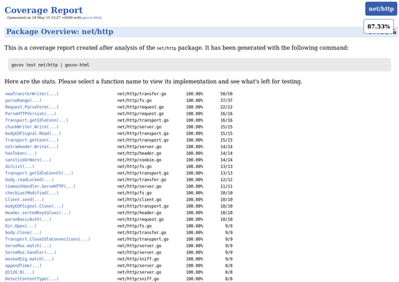
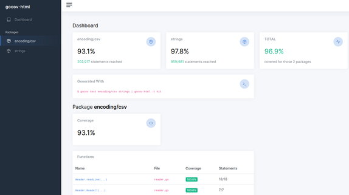

# Available Themes

## golang

This is the default theme:

```shell
$ gocov test strings | gocov-html -t golang > strings.html
```



## kit

Uses the [AdminKit](https://adminkit.io) theme:

```shell
$ gocov test encoding/csv strings | gocov-html -t kit > strings.html
```

